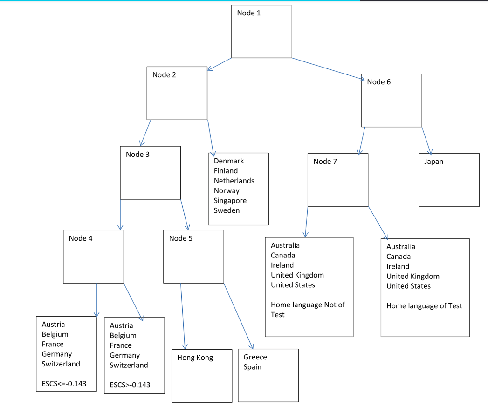

```{r setup, include=FALSE}
options(htmltools.dir.version = FALSE)
knitr::opts_chunk$set(
  fig.width=9, fig.height=3.5, fig.retina=3,
  out.width = "100%",
  cache = FALSE,
  echo = FALSE,
  message = FALSE, 
  warning = FALSE,
  hiline = TRUE
)


library(RefManageR)
BibOptions(check.entries = FALSE, bib.style = "authoryear", style = "markdown",
           dashed = TRUE)

BibOptions(hyperlink=FALSE);

bib <- ReadBib("references.bib")
```

```{r xaringan-themer, include=FALSE, warning=FALSE}
library(xaringanthemer)

primary_color <- "#FFFFFF" #"#024959"
secondary_color <- "#024959"#"#F2D605"
xaringanthemer::style_duo(
  primary_color = primary_color,
  secondary_color = secondary_color,
  header_font_google = google_font("Didact Gothic", "400", "400i"),
  text_font_google   = google_font("IBM Plex Sans", "400", "400i"),
  text_font_size = "1.5rem",
  )

style_extra_css(css = list(
#  ".title" = list(background_image="unsplash/arthur-hinton-6YDn7__tato-unsplash.jpg"),
  ".todo" = list(color = "#17C25B"),
                           ".optional" = list(color = "#05BCE6"),
                           ".large" = list(`font-size` = "130%"),
                           ".small" = list(`font-size` = "80%"),
                           ".tiny" = list(`font-size` = "50%"),
                           ".full" = list(padding = "0px",
                                          margin = "0px",
                                          border = "0px"),
                           ".vertical" = list(`writing-mode` = "vertical-rl",
                                              `text-orientation` = "mixed")),
                )


library(semtree)
library(ggplot2)
library(tidyverse)
library(svglite)
library(qrcode)

```
class: center middle

# Question: In a theory-driven multivariate model, which variables function as relevant predictors, covariates, or moderators?

---

class: center middle
background-image: url("unsplash/arthur-hinton-6YDn7__tato-unsplash.jpg")
background-size: cover

# SEM + Decision Trees + Focus Parameters + Random Forests + Variable Importance

(+ measurement invariance + continuous time + reproducibility + ... )

<p style="color:white;">Roadmap</p>
---


# SEM = Structure + Measurement

```{r}
knitr::include_graphics("img/SEM-measurement-structure.png")
```
---
# SEM
- More formally, we assume that we have $l$ variables of which $p$ are latent variables

- In RAM notation, we define:
  - a covariance matrix $\mathbf{S} \in \mathbb{R}^{l \times l}$ (“symmetric relations”), 
  - a structural matrix $\mathbf{A} \in \mathbb{R}^{l \times l}$ (“asymmetric relations”), 
  - and a filter matrix $\mathbf{F}\in \mathbb{R}^{p \times l}$ to filter out only observed variables

---
# SEM

Then, the model-implied covariance matrix becomes:

$$\mathbf{ \Sigma = F \left(I_l - A \right)^{-1} S \left( I_l - A \right)^{-T} F^T }$$
And (covariance) likelihood fit function (based on multivariate normal assumption) of observed covariance $S$:

<!--
$$-2LL = ln|\mathbf{\Sigma}|+tr\left(\mathbf{\Sigma^{-1} S} \right)-ln\left| \mathbf{S} \right| - \mathbf{p} $$
-->
$$-2LL = ln|\mathbf{\Sigma}|+tr\left(\mathbf{\Sigma^{-1} S} \right)-ln\left| \mathbf{S} \right| - \mathbf{p} $$
(for multiple independent groups, the log-likelihoods sum up; means omitted here)

---
# Theory-driven modeling


---
# Decision Trees
<center>


---
# Decision Trees
<center>


`r Citet(bib, "gigerenzer2005fast")`

---
 
# Data-driven modeling


---
class: inverse, center, middle
# SEM Trees

`r Citep(bib, c("brandmaier2013structural"))`; an instance of model-based recursive partitioning `r Citep(bib, c("zeileis2008model"))` 

---
# Theory-guided exploration


<small>`r Citet(bib,"brandmaier2016theory")` </small>

---

# A Simple Example: Wechsler Intelligence Scale for Children

.pull-left[

]

.pull-right[

]

<small>`r Citet(bib, "brandmaier2013structural")`</small>

---
# A Simple Example: WISC


<center>


<small>N=204 children, McArdle & Epstein, 1987</small>

---

# A Simple Example: WISC


<center>


---

# A Simple Example: WISC

<center>


---

# A Simple Example: WISC

<center>

---

# What do splits represent?

Splits in an LGCM may represent any combination of:
--

- Differences in mean within-person changes

--
- Differences in interindividual differences in within-person change
--

- Differences in the mean of the intercept
--

- Differences in interindividual differences in the intercept
--

- Differences in the correlation of intercept and within-person change
--

- Differences in reliability or growth curve misfit (differences in measurement error as part of the model residual variance)

---
class: inverse, center, middle
# Evaluating Splits in (SEM) Trees
---
# Testing for group differences

`r Citet(bib, c("brandmaier2013structural"))` proposed  old-school likelihood ratio test for _split selection_:

Given a parametric model $M$ with ML parameter estimates $\hat{\theta}$ and data $X$, which is exhaustively split into $X_1$ and $X_2$ with corresponding maximum likelihood estimates $\hat{\theta}_1$ and $\hat{\theta}_2$:
--

$$LR = -2LL \left( X_{1}|M(\hat{\theta}_1) \right)-2LL \left(X_{2}|M(\hat{\theta}_2) \right) + 2LL \left(X|\hat{\theta}) \right)$$
which is asymptotically $\chi^2$-distributed if $H_0$ is true (i.e., no group differences) with $df = dim(\theta)$

---
# Split selection

- Starting at the root of a tree, find best split by greedy search
- Depending on measurement scale
  - all possible split points for ordinal and metric variables (linear costs)
  - all possible dichotomizations for nominal variables (exponential costs)
- Continue splitting if difference is significant

Effects of interest can be in any subset of model parameters
---

# Focus parameters with LR tests

For $\chi^2$-based tests, instead of:

$$LR = -2LL \left( X_{1}|M(\hat{\theta}_1) \right)-2LL \left(X_{2}|M(\hat{\theta}_2) \right) + 2LL \left(X|\hat{\theta}) \right)$$
we estimate *loss of fit due to constraining only focus parameters* to identity across groups:

$$ LR = -2LL \left( X_1 \mid M(\hat{\theta}_1) \right) -2LL \left( X_2 \mid M(\hat{\theta}_2) \right) \\ -2LL \left( X_1 \mid M(\hat{\theta}'_1) \right) -2LL \left( X_2 \mid M(\hat{\theta}'_2) \right) $$


<!-- 
\left( X_{2} \mid M(\hat{\theta}_2) \right) 
-2LL \left( X_{1} \mid M(\hat{\theta}'_1) \right) -2LL \left(X_{2}|M(\hat{\theta}'_2)) \right)
-->

with focus parameters constrained to be identical across groups for $\theta'_1$ and $\theta'_2$


---
# Focus parameters

This is more expensive because we need to obtain maximum likelihood estimates for every possible split:
$$argmin_{\theta'_1, \theta'_2}  -2LL \left( X_{1}|M(\theta'_1))-2LL(X_{2}|M(\theta'_2)) \right)$$
subject to focus parameters being identical

In total, we need one more iterative optimization process per each potential split point (with potentially more convergence issues)
---

<center>


---
# Score-based Tests

.pull-left[
- Likelihood ratio tests are computationally expensive, we get convergence problems, naive LR test suffer from variable selection bias like CART  `r Citep(bib, c("strobl2007bias"))` 
- Let's use score tests (proposed for general model-based partitioning by `r Citet(bib, c("zeileis2008model"))` 
]

.pull-right[
<center>

]
---
# Score-based Tests

.pull-left[

]
.pull-right[
.small[
- Score based test statistics are functions of the case-wise derivatives of the (log)likelihood function
- Backbone of MOB in `party/partykit` and were also brought to SEM trees by `r Citep(bib,"arnold2021score")`
- Under H0 (no informative split), the cumulative score process is a Brownian bridge
- Various statistics available (e.g. maximum Lagrange multiplier $maxLM$; double maximum for illustration on the left)
- By computing them on subsets of parameters, we get _focus parameters_ for free
]
]
---


# Variable Importance

.pull-left[
- Single trees are unstable
- Subsample data and predictors to create a forest with diverse predictor combinations
- Using a permutation approach, estimate contribution of each predictor to misfit `r Citep(bib,"brandmaier2016theory")`
- ...but beware of marginal importance; `r Citep(bib,"strobl2008conditional")`

]

.pull-right[
.small[
Example: Terminal decline of happiness from SOEP data `r Citep(bib,"brandmaier2017terminal")`
]


]


---
class: center middle
# A minimal example

---
# Univariate predictions

Let's simulate some Gaussian data and two dichotomous predictors `pred_mean` and `pred_var` that perfectly predict differences in either location (0 vs 1) or scale (1 vs 2).  Also, we throw three uninformative predictors in the mix (binomial distributed) and sample $1,000$ cases:

<center>

---
# Run a tree

Specify model in `OpenMx` (or `lavaan`):
```{r echo=TRUE, eval=FALSE}
sem <- mxModel("Univariate Gaussian",
  type="RAM",  manifestVars="y",
               [...]
  # variance
  mxPath(from=manifests,arrows=2,free=TRUE,
     values = c(1), labels=c("var_y")),
# means
   mxPath(from="one",to=manifests, arrows=1,free=TRUE,
          values=c(0), labels=c("mean_y") )
 
```  
---
# Run a tree

Run the tree
```{r echo=TRUE, eval=FALSE}
sem <- mxModel("Univariate Gaussian",
  type="RAM", manifestVars="y",
               [...]
  # variance
  mxPath(from=manifests,arrows=2,free=TRUE,
     values = c(1), labels=c("var_y")),
# means
   mxPath(from="one",to=manifests, arrows=1,free=TRUE,
          values=c(0), labels=c("mean_y") )
  
tree <- semtree(sem, simulated_data, 
   control=semtree_control(method="score"),
{{  constraints=semtree.constraints(focus.parameters = "mean_y"))}}
```  
---
# Tree with and w/o focus

This seems to work...

.pull-left[
```{r}
tree_nofocus_04 <- readRDS("data/04_univsim_semtree.rds")
plot(tree_nofocus_04)
```
(No focus)
]

.pull-right[
```{r}
tree_focus_04 <- readRDS("data/04_univsim_semtree_f1.rds")
plot(tree_focus_04)
```
(focus on _mean\_y_)
]
---
# To Focus or not to focus

*By the way*: Trees yield identical results in `partykit` and `semtree` (with focus parameter on mean): 

```{r}
tree_party <- readRDS("data/04_univsim_tree_partykit.rds")
tree_semtree <- readRDS("data/04_univsim_semtree_f1.rds")
```
.pull-left[
```{r}
plot(tree_party)
```
made with ❤ by `partykit`
]

.pull-right[
```{r}
plot(tree_semtree)
```
made with ❤ by `semtree`
]

W/o focus: potentially interesting because differences in variances may also be of interest (e.g., meaningful individual differences or reliability differences)

---
# Run a forest

Run a SEM forest based on a single indicator model with two parameters (mean and variance) again *with focus parameter* and compute variable importance
```{r echo=TRUE, eval=FALSE}
forest <- semforest(sem, simulated_data,     
      control=semforest_score_control(num.trees=100),
      constraints=semtree.constraints(focus.parameters = "mean_y")) 

vim <- varimp(forest)

```


---
# (Marginal) Variable importance estimate
```{r}
vim_old<-readRDS("data/04_univsim_vim_semtree_f1old.rds")
plot(vim_old)
```
This is flawed because the influence of _pred\_var_ should be about zero.
---

# Problem

With SEM forest, we grow trees with

- subsampling of predictors (`mtry=2` or $\sqrt{m}$ or ..)
- no stopping rule ($\alpha=1$) in order to explore deep conditional effects (~interactions) in the trees

Therefore, the permutation importance estimate will be influenced by differences with respect to all parameters of the model because all predictors will appear in the forest

---
# Inspect first tree
(Pruned) Tree from a forest with focus parameters
```{r}
forest <- readRDS("data/04_sf_f1.rds")

plot(semtree::prune(forest$forest[[2]],2))
```
---
# Inspect second tree
Another (pruned) Tree from a forest with focus parameters
```{r}
plot(prune(forest$forest[[11]],2))
```
---
# Problem

Problem: This measure of variable importance considers differences w.r.t all parameters of the SEM

Solution: Estimate misfit incurred by only the focus parameters

---
# Algorithm (estimate importance for focus parameters)

Heuristic (😇) Importance Evaluation:

- For each tree, for each observation $x$, find leaf model $M_1$ by traversing the tree and leaf model $M_2$ by traversing the tree after permuting predictor in question
- Compute -2LL of $x$ under $M_1$
- <s>Compute -2LL of $x$ under $M_2$</s>
- Compute -2LL of $x$ under $M_1$ with only focus parameters plugged in from $M_2$
- Compute -2LL difference 
---

# Back to the simulation

Simulated Data:


---
# Importance Estimates

Forest with (score-based) focus parameter on mean:

.pull-left[
```{r ll}
vim_new<-readRDS("data/04_univsim_vim_semtree_f1.rds")
vim_old<-readRDS("data/04_univsim_vim_semtree_f1old.rds")
plot(vim_old,xlim=c(0,200))
```
(old scheme)
]

.pull-right[
```{r lr}
plot(vim_new, xlim=c(0,200))
```
(new scheme)
]
---

class: inverse, center, middle
# Some more examples

---

# Back to Latent Growth Curve Models

.pull-left[


.small[
Differences in intercept variance (2,5; cols) or slope variance (2;5, rows), $n=200$ per group
]
]

.pull-right[

]
---
# Back to Latent Growth Curve Models

```{r}

err<-readRDS("data/08_lgcm_vim_err.rds")
icept<-readRDS("data/08_lgcm_vim_icept.rds")
slope<-readRDS("data/08_lgcm_vim_slope.rds")

par(mfrow=c(1,3),mar=c(0.5,0.5,0.5,0.5))
plot(icept,xlim=c(0,50), main="Icept")
plot(err,xlim=c(0,50), main="Residual")
plot(slope, xlim=c(0,50), main="Slope")

```

---

# Example: Negative Affect

To illustrate, we look at the `affect` dataset from `psychTools`

- Collection of pretest data using 5 scales from the Eysenck Personality Inventory and items taken from the Motivational State Questionnaire (see msq. In addition, state and trait anxiety measures were given. 

- $n=330$ subjects were randomly assigned to one of four movie conditions: 1: Frontline. A documentary about the liberation of the Bergen-Belsen concentration camp. 2: Halloween. A horror film. 3: National Geographic, a nature film about the Serengeti plain. 4: Parenthood. A comedy. 

- Data from the MSQ were scored for Energetic and Tense Arousal (EA and TA) as well as Positive and Negative Affect (PA and NA). 


---

# Compare party(kit) and SEM trees

- We use the difference of NA from pre-test to post-test as outcome
- Run a `partykit` model, a SEM tree with focus parameter on the mean of `DeltaNA` and one without focus parameters

```{r out.height="30%"}
load("filmtrees.rds")
ggplot2::ggplot(tree.data, aes(x=DeltaNA))+geom_density()
```

---

# Score-based tree (no constraints)

```{r}
load("filmtrees.rds")
plot(tree)
```
---
# Score-based tree (with focus-parameter)

```{r}
load("filmtrees.rds")
plot(treeF)
```

(Identical split selection as `partykit` would do)
---

# Implied Multi-Group Model

.pull-left[
```{r}
plot(pl1)
```
No Focus
]

.pull-right[
```{r}
plot(pl2)
```
With Focus / partykit
]

---

# Forest with focus parameters

```{r}
load("filmforest.rds")
plot(vim,aggregate = "median")
```

<small>100 score-based trees, median variable importance, all estimates are positive</small>
---

# Journal Pricing

- The model to be partitioned is a linear regression for the number of library subscriptions by price per citation in log-log specification (i.e., with $k = 2$ coefficients) `r Citet(bib, c("zeileis2008model"))` 

- Predictors: the raw price and number of citations, the age of the journal, number of characters and a factor indicating whether the journal is associated with a society or not.

```{r echo=TRUE, eval=FALSE}
library(partykit)
j_tree <- partykit::lmtree(logsubs ~ lpc | price + citations +
                   + age + chars + society, data = Journals)
```
---
# Journal Pricing
```{r echo=FALSE, eval=TRUE}
data("Journals", package = "AER")
Journals <- transform(Journals,
                      age = 2000 - foundingyear,
                      chars = charpp * pages,
                      lpc = log(price/citations),
                      logsubs = log(subs))

library(partykit)

j_tree <- lmtree(logsubs ~ lpc | price + citations +
                   + age + chars + society, data = Journals, minsize = 10)

#j_tree <- lmtree(logsubs ~ lpc | citations, data = Journals, minsize = 10, verbose = TRUE)
plot(j_tree)
``` 

(Subscriptions per price-by-citation in log-scale)
---
# Regression SEM Tree


---

# SEM Tree with focus paramater

Focus parameter on regression coefficient and constant:

```{r out.height="80%"}
tree<-readRDS("data/02_tree_foc_2coef.rds")
plot(tree)
```
Identical result: somewhat shallower slope for older journals
---
# Tree w/o focus parameter

.pull-left[
- If we run the tree without focus parameter, all parameters become potentially relevant
- Splits could be because of differences in intercept, differences in residual variance, or differences in predictor variance
]

.pull-right[
```{r}
tree<-readRDS("data/02_tree_unc.rds")
plot(tree)

param_leafs<-sapply(getLeafs(tree), function(x){ x$params})
colnames(param_leafs)<-paste0("Leaf #",1:ncol(param_leafs))
param_leafs <- round(param_leafs,2)
```
]
---
# Parameter Estimates of Trees

Here, we find differences w.r.t. all parameters (e.g., predictor mean and variance _MEAN\_lpc_ and _VAR\_lpc_) and also a large range of regression coefficients $b_1$ ranging from `r min(param_leafs["b1",])` to `r max(param_leafs["b1",])`.
```{r}
knitr::kable(param_leafs)
```
---

class: inverse, center, middle

# Measurement Invariance
---

# Measurement Invariance Testing

- "Lack of evidence of measurement invariance equivocates conclusions and casts doubt on theory in the behavioral sciences" `r Citep(bib, "horn1992practical")`
--

- Measurement Invariance is usually based on multigrop SEM/CFA `r Citep(bib, "marsh2014exploratory")`
--

- SEM Trees were suggested as a tool for measurement invariance testing, that is, to explore differential item functioning `r Citep(bib, c("finch2017structural","sterner2023exploratory"))`, that is to find moderators of factor loadings
--

- CFA partitioning can even be used without any groups at all `r Citep(bib, c("merkle2013tests"))`  
--

- As an example, `r Citet(bib, c("finch2017structural"))`  looked at a _attitudes towards reading items_ questionnaire


---
# Measurement Invariance

.pull-left[

]

.pull-right[
> SEMtree does not isolate specific differences among model parameters, but rather identifies differences in whole patterns of model parameters - `r Citep(bib, "finch2017structural")`
]

---
# BFI

As an example:

-  International Personality Item Pool `bfi` from `psych` package
- $n=2,800$
- 25 personality self report items (representing 5 OCEAN factors)
- Three demographic variables as predictors: age (metric), education (ordinal), sex (nominal)

---
# BFI

- Specify a CFA of five indicators for the construct _extraversion_: "don't talk a lot", "find it difficult to approach others", "Know how to captivate propl", "Make friends easily", "Take charge"
- Anchor item: "don't talk a lot"
- choose only factor loadings and residuals as focus parameters (but not intercepts or latent mean/variance)
- Predictors: age, sex, and education
---
# BFI Tree
```{r}
tree<-readRDS("data/06_tree_focus.rds")
plot(prune(tree,3))
```
---
# BFI Loadings


.small[
(f3: Know how to captivate people and f5: Take charge - professional skills vs personality?)
]
---
# BFI Forest
Permutation variable importance with focus parameters loadings:

```{r}
vim <- readRDS("data/06_bfi_vim.rds")
plot(vim)
```
---

# Recent Extensions - CT-SEM Forests

Continuous-Time Structural Equation Forests `r  Citep(bib, "cancer2025continuous")` 

<center>

---

# Recent Extensions - CT-SEM Forests

- relatively large type-I error rates in some conditions
- variable importance estimates remain robust
- excessive runtimes, e.g. study 1: `r round(64*14.3,2)` min for the forest and `r round(64*0.6,2)` min for the variable importance estimates (N=1,000, 4 repeated measures, 15 predictors)

---

# Outlook I

.pull-left[
- Adapt BORUTA `r  Citep(bib, "boruta")` to SEM Tree (with Priyanka Paul & Timothy Brick, PennState)
- BORUTA is a heuristic to determine a cut-off between important and not-important variables 
]

.pull-right[
<center></center>

A spirit or devil from slavic mythology, <small>image from Wikipedia/Public Domain</small>
]

---

# Outlook II

(Joint) Ordinal models using threshold models (example: mammography screening experience and opinions from `r Citep(bib, "hothorn2006unbiased")` with $n=412$)

.pull-left[
```{r}
ptree<-readRDS("data/05_mammo_partytree.rds")
stree<-readRDS("data/05_mammo_tree.rds")
plot(ptree)
```

.small[
- SYMPT: You do not need a mamogram unless you develop symptoms
- PB: Perceived benefit (low value = strong benefit)
]
]

.pull-right[

]
---
# Summary

- SEM Trees and Forests are a form of model-based recursive partitioning
- They can be implemented either via the `semtree` package or via `partykit` (https://www.zeileis.org/news/lavaantree/)
- Offer a way to explore theory-driven SEM with variable importance and partial dependence plots
- Focus parameters may be important when exploring the importance of predictors for subsets of parameters (e.g., individual differences vs means, or intercept vs slopes in growth models)
- If you have a theory, test the theory first, then explore!

---

class: center
# <s>Commercial</s> Break: Ωnyx
 
 

 
https://onyx-sem.com/ and [https://github.com/brandmaier/onyx](https://github.com/brandmaier/onyx) and for Julia fans: https://github.com/StructuralEquationModels/StructuralEquationModels.jl
---
# Thank You

- Slides: https://github.com/brandmaier/talk-fu2025-semtree

- Package on CRAN: `semtree`

.pull-left[
Contact: andreas.brandmaier@medicalschool-berlin.de or .strong[@brandmaier.bsky.social] on Bluesky or .strong[https://www.brandmaier.de]

]

.pull-right[

```{r, echo=FALSE}
link <- "https://github.com/brandmaier/talk-fu2025-semtree"
```

```{r, echo=FALSE, out.width = "30%", out.extra='style="float:center"'}
#if (!file.exists("img/qr_slides.svg")) {
generate_svg(qr_code(link), here::here("img/", "qr_slides.svg"), foreground = secondary_color, background = primary_color, show = FALSE)
#}

```
]
---

class: inverse, center, middle
# Reproducibility + Exploratory Methods
---

# Why should we work reproducibly?

Many good reasons like: 

- Transparency
- Trustworthiness
- Replication
- Cumulative science

> Transparency and accessibility are central scientific values, and open, reproducible projects will increase the efficiency and veracity of knowledge accumulation `r Citep(bib, "bar2012reporting")`.

---

## Your closest collaborator is you six months ago, but you don’t reply to emails.

.footnote[From Karl Broman's lecture on reproducibility, paraphrasing Mark Holden]

---


# Sources of Failure to Reproduce Results

.pull-right[  ]

1. **Multiple versions of scripts/data** (e.g., dataset has changed over, i.e., was further cleaned or extended)

--

2. **Multiple scripts** in a pipeline; unclear which scripts should be executed in which order

--

3. **Copy&paste errors** (e.g., inconsistency between reported result and reproduced result)

--

4. Broken **software dependencies** (e.g., analysis broken after update, missing package, just comes out differently on a different computer )


---

# Four Elements of Reproducibility

.center[

```{r, echo=FALSE, out.width='60%'}
knitr::include_graphics("img/nutshell.png")
```

]

.footnote[from Peikert and Brandmaier (2020) and `repro` package]
---
class: center, middle

# reproducibleRchunks


 

(`r Citep(bib, "brandmaier2025automated")`, now on CRAN: reproducibleRchunks)

---
# References

.small[
```{r, results='asis', echo=FALSE}
PrintBibliography(bib, start=1, end=6)
```
]

---
.small[
```{r, results='asis', echo=FALSE}
PrintBibliography(bib, start=7, end=7+5)
```
]
---
.small[
```{r, results='asis', echo=FALSE}
PrintBibliography(bib, start=13)
```
]